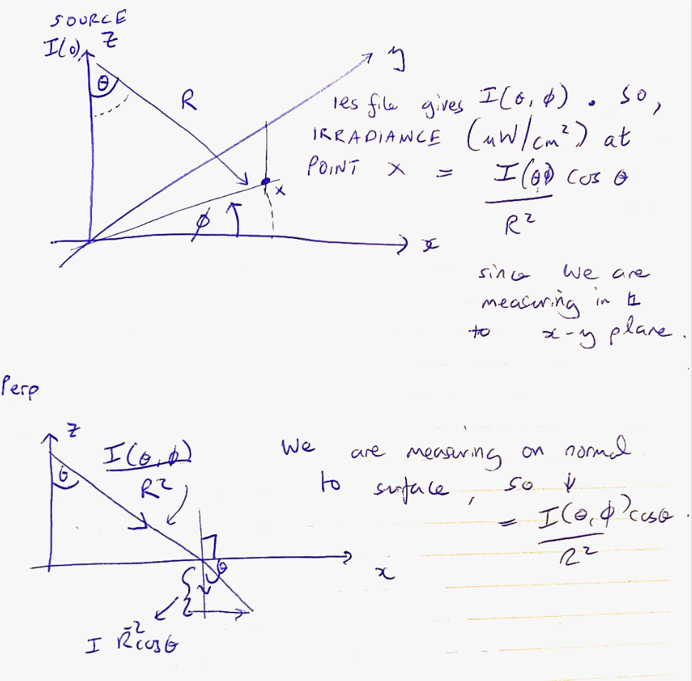

# IES Irradiance Calculator

This program calculates the average irradiance at a specified height in a room based on an IES file of a light fixture placed centrally in such a room. 
This is used to sense check some calculations in my investigations on modelling far UVC in some rooms. 

## Setup

1. Create and activate the virtual environment:

   **On macOS/Linux:**
   ```bash
   # Make the setup script executable
   chmod +x setup_venv.sh
   
   # Run the setup script
   ./setup_venv.sh
   ```

   **On Windows:**
   ```bash
   # Create virtual environment
   python -m venv venv
   
   # Activate virtual environment
   .\venv\Scripts\activate
   
   # Install requirements
   pip install -r requirements.txt
   ```

2. To activate the virtual environment in future sessions:
   - On macOS/Linux: `source venv/bin/activate`
   - On Windows: `.\venv\Scripts\activate`

## Usage

1. Make sure your virtual environment is activated (you should see `(venv)` in your terminal prompt)

2. Place your IES file in the same directory as the script or provide the full path to the IES file.

3. Modify the parameters in the `main()` function of `ies_irradiance_calculator.py`:
   - `ies_file_path`: Path to your IES file
   - `room_width`: Width of the room in meters
   - `room_length`: Length of the room in meters
   - `mounting_height`: Height at which the light fixture is mounted in meters
   - `target_height`: Height at which you want to calculate the average irradiance in meters

4. Run the script:
```bash
python ies_irradiance_calculator.py
```

## Output

The program will output the average irradiance in micro W / cm^2 across a flat surface at a specified height. 

## How it Works

1. The program parses the IES file to extract the photometric data (W / sterradians at different values of theta, phi in the diagram above).
2. It creates an interpolator to estimate candela values at any angle.
3. For each point in a grid at the specified height, it:
   - Calculates the distance and angles to the light fixture
   - Determines the candela value at those angles
   - Applies the inverse square law to calculate irradiance
4. Finally, it averages the irradiance values across all points to get the average irradiance at that height.

## Irradiance Calculation Geometry

Below is a diagram showing the geometry and formula used for irradiance calculation at a given point:



## Notes

- The default grid size for calculations is 0.5 meters. You can adjust this in the `calculate_average_irradiance` method.
- The program assumes the light fixture is mounted at the center of the room.
- All measurements should be in meters. 